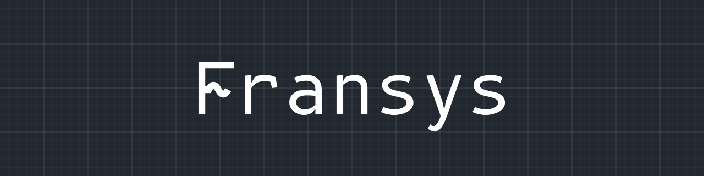

# 

Fransys is a Python toolkit for electrical cabinet and harness design. You write the design as a
short Python script against a part library, and Fransys checks it as it builds.

From that one model it produces the schematic PDF, the parts, terminal, cable and PLC lists, and
the KiCad and WAGO exports. Every output is a pure function of the model, so the same design
always gives the same bytes.

**Beta.** Fransys is in beta until 1.0.0. The API may change between minor versions, and each
release's guide says what changed.

[](https://olejbondahl.github.io/fransys/)

## What it does

- **Design as code.** Devices, terminal strips, wires, cables and PLC channels are Python calls.
  A circuit you repeat is a function or a loop.
- **Checked as it builds.** Fransys checks the design against its part library. An error stops
  `fr.write`, so no export is written from a design that has one.
- **Drawn for you.** Pages are laid out automatically, with IEC 60617 symbols, IEC 81346
  designations and cross-references between pages. Hints in the script steer the layout.
- **Every list from one model.** Parts, terminals, wires, cables, PLC I/O and designations as
  CSV, a KiCad netlist, WAGO module XML and an interactive system overview.
- **Units and releases.** A board or a sub-cabinet is a unit with its own drawing and revision.
  `fr.release` freezes a baseline, and `fr.diff` lists what changed since.

## A first design

This script builds a small motor starter from the demo part library and writes its PDF into
`out/`. The picture above is its first schematic page.

```python
"""A small motor starter, built and written as one PDF into out/."""

from pathlib import Path

import fransys as fr
from fransys.colours import BK, BU

d = fr.design("demo_parts", place="C1")
cabinet = d.location("C1", "Motor starter")
x0 = d.terminal_strip("X0", "DEMO-TB-2.5")
ac = d.ac_supply("400V", "230", x0[1], x0[2], x0[3])
g1 = d.device("G1", "DEMO-PSU-24")
dc = d.dc_supply("24VDC", g1)
q0, q1, f1 = (
    d.device(t, p)
    for t, p in (("Q0", "DEMO-MCB-3P"), ("Q1", "DEMO-CTR-3P-24"), ("F1", "DEMO-OVERLOAD-3P"))
)
s1, s2 = (d.device(t, "DEMO-CTR-BLOCK-1NO1NC") for t in ("S1", "S2"))
x1 = d.terminal_strip("X1", "DEMO-TB-2.5", pe="DEMO-TB-PE-2.5")
w1 = d.cable("W1", "DEMO-CBL-4G1.5")
m1 = d.device("M1", "DEMO-MOTOR-4KW", place=None)
d.series(ac, q0.element, q1.main, f1.main, x1, w1, m1, wire=(BK, 2.5))
d.series(dc.plus, s1.nc, d.parallel(s2.no, q1.aux), f1.aux, q1.coil, dc.minus, wire=(BU, 0.75))
cover = Path("cover.md")
cover.write_text("# Motor starter\n", encoding="utf-8")
result = fr.build(d, fr.document(fr.DocumentPreset.CABINET_SCHEMATIC, cabinet, cover=cover))
errors = [f for f in fr.check(result) if f.severity is fr.Severity.ERROR]
if errors:
    raise SystemExit(errors)
fr.write(result, Path("out"))
```

Run it from a clone of this repository, with [uv](https://docs.astral.sh/uv/):

```bash
git clone https://github.com/OleJBondahl/fransys
cd fransys
uv sync
uv run python website/example.py
```

## Install

Fransys needs Python 3.15 and is not on PyPI yet. Add it to your project as a git dependency, at
a release tag:

```bash
uv add "fransys @ git+https://github.com/OleJBondahl/fransys@vX.Y.Z#subdirectory=packages/fransys"
```

Replace `vX.Y.Z` with a [release tag](https://github.com/OleJBondahl/fransys/tags). Your project
imports only `fransys`:

```python
import fransys as fr
```

## Documentation

- [The documentation site](https://olejbondahl.github.io/fransys/): the guide, the part-file
  contract, the examples gallery with every export, the API reference and the roadmap.
- The guide also ships inside the installed package, in `fransys/guide/`, so it always matches
  the version you pinned. A coding agent reads `AGENTS.md` there first.

## What is in this repository

| Folder | What it holds |
|---|---|
| `packages/` | The Fransys packages. A project imports only `fransys`. |
| `examples/pump-station/` | A complete design on real catalogue parts, with every export in `out/`. It is a project of its own, pinned to a release tag: copy it as a starting point. |
| `examples/demo-parts/` | A small invented part library for the guide and the tests. |
| `tests/` | Tests that span the workspace: import boundaries, version pins, names, the README example. |
| `scripts/` | The scripts behind `just ci` and `just site`. |
| `website/` | The source of the documentation site. |
| `docs/contracts/part-file.md` | The contract a part library is written against. |

| Package | Role |
|---|---|
| `fransys` | Facade: pipeline, findings policy, file writing, CLI |
| `fransys-model` | Hub: records, `Draft`, `freeze`, `Model`, derive, rows |
| `fransys-parts` | Input: part-file loader and linter |
| `fransys-author` | Input: the Python authoring API |
| `fransys-layout` | Layout passes; writes `layout.*` records |
| `fransys-render` | Output: laid-out model to SVG pages |
| `fransys-pdf` | Output: document assembly to PDF |
| `fransys-reports` | Output: lists to CSV |
| `fransys-kicad` | Output: KiCad netlist. Dev tool: KiCad symbol to part-file skeleton |
| `fransys-wago` | Output: WAGO module XML |
| `fransys-overview` | Output: interactive system overview HTML |
| `electrical-symbols` | IEC 60617 symbol data |

The symbols are built with [`graphical-symbols`](https://github.com/OleJBondahl/graphical-symbols),
a separate public toolkit that Fransys pins by tag.

## Develop

```bash
uv sync
uv run just ci
```

`just ci` is the gate of the workspace: lint, format, types, the lean-code limits, and the tests
with coverage. `uv run just --list` shows the other recipes. `examples/pump-station/` is a
project of its own, with its own `just ci`.

## Contributing

Bug reports, questions and feature ideas are welcome as GitHub issues. For a feature, open an
issue first, so its shape is agreed before you build it.

To send a change, fork the repository, work on a branch, and open a pull request once
`uv run just ci` passes. The gate checks the code rules: the import boundaries between
packages, short functions and docstrings, and each package's coverage floor. A change that
moves a golden file regenerates it with `uv run just regen-goldens` and says why in the pull
request. New symbols are drawn in our own geometry after the conventions of IEC 60617, never
copied from the standard.

This repository's commits are release exports from the maintainer's private development
repositories. A pull request is therefore not merged here. It is carried into development
with you as its author and ships in the next release. The release commit credits you as
co-author, and the pull request is closed with a link to it.

## License

MIT. See [`LICENSE`](LICENSE).
