# IEC 60617 symbols

Generated by `write_build`; do not edit. A symbol stays `unverified` until its geometry is compared with the standard's own drawing.

| Number | Name | Kind | Status | Plain | Annotated |
| --- | --- | --- | --- | --- | --- |
| [actuator-mushroom](resolved/actuator-mushroom.json) | Actuator (mushroom head, operated by pushing) | qualifier | unverified |  |  |
| [actuator-push](resolved/actuator-push.json) | Actuator (operated by pushing) | qualifier | unverified |  |  |
| [break-contact](resolved/break-contact.json) | Break contact | symbol | unverified |  |  |
| [capacitor](resolved/capacitor.json) | Capacitor, general symbol | symbol | unverified |  | 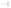 |
| [change-over-contact](resolved/change-over-contact.json) | Change-over break before make contact | symbol | unverified |  |  |
| [circuit-breaker](resolved/circuit-breaker.json) | Circuit breaker | symbol | unverified |  | 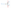 |
| [circuit-breaker-function](resolved/circuit-breaker-function.json) | Circuit breaker function | qualifier | unverified |  |  |
| [coil](resolved/coil.json) | Coil, general symbol | symbol | unverified |  | 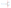 |
| [connection-point](resolved/connection-point.json) | Connection point | symbol | unverified |  |  |
| [connector-fixed](resolved/connector-fixed.json) | Connector, fixed portion of an assembly | symbol | unverified |  | 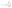 |
| [contact](resolved/contact.json) | Connector contact, no stated gender | symbol | unverified |  |  |
| [contact-female](resolved/contact-female.json) | Connector contact, female (socket) | symbol | unverified |  |  |
| [contact-male](resolved/contact-male.json) | Connector contact, male (plug) | symbol | unverified |  |  |
| [converter-dc-dc](resolved/converter-dc-dc.json) | DC/DC converter | symbol | unverified |  | 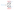 |
| [current-transformer](resolved/current-transformer.json) | Current transformer, general symbol | symbol | unverified |  |  |
| [diode](resolved/diode.json) | Semiconductor diode, general symbol | symbol | unverified |  | 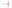 |
| [earth](resolved/earth.json) | Earth, general symbol | symbol | unverified |  |  |
| [emergency-stop](resolved/emergency-stop.json) | Emergency stop, mushroom push-button with latching break contact | symbol | unverified |  |  |
| [fuse](resolved/fuse.json) | Fuse | symbol | unverified |  | 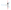 |
| [ground](resolved/ground.json) | Ground, reference (0 V) symbol | symbol | unverified |  |  |
| [lamp](resolved/lamp.json) | Lamp, general symbol | symbol | unverified |  | 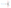 |
| [make-contact](resolved/make-contact.json) | Make contact, general symbol | symbol | unverified |  | 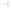 |
| [motor-1ph](resolved/motor-1ph.json) | Induction motor, single-phase, squirrel-cage | symbol | unverified |  |  |
| [motor-1ph-pe](resolved/motor-1ph-pe.json) | Induction motor, single-phase, squirrel-cage, with protective earth terminal | symbol | unverified |  |  |
| [motor-3ph](resolved/motor-3ph.json) | Induction motor, three-phase, squirrel cage | symbol | unverified |  |  |
| [motor-3ph-pe](resolved/motor-3ph-pe.json) | Induction motor, three-phase, squirrel cage, with protective earth terminal | symbol | unverified |  | 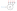 |
| [operating-device](resolved/operating-device.json) | Operating device, general symbol; relay coil, general symbol | symbol | unverified |  | 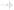 |
| [plc-channel](resolved/plc-channel.json) | PLC channel (column end) | symbol | unverified |  | 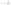 |
| [power-supply](resolved/power-supply.json) | Power supply, rail symbol | symbol | unverified |  |  |
| [protective-earth](resolved/protective-earth.json) | Protective earth | symbol | unverified |  |  |
| [psu](resolved/psu.json) | Power supply unit (a.c./d.c. in, d.c. out) | symbol | unverified |  |  |
| [push-button](resolved/push-button.json) | Switch, manually operated, push-button, automatic return | symbol | unverified |  | 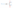 |
| [rcd](resolved/rcd.json) | Residual current operated circuit breaker | symbol | unverified |  |  |
| [rectifier](resolved/rectifier.json) | Rectifier | symbol | unverified |  | 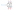 |
| [rectifier-pe](resolved/rectifier-pe.json) | Rectifier, with protective earth terminal | symbol | unverified |  | 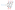 |
| [residual-current-core](resolved/residual-current-core.json) | Residual current sensing core | qualifier | unverified |  |  |
| [resistor](resolved/resistor.json) | Resistor, general symbol | symbol | unverified |  | 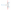 |
| [terminal](resolved/terminal.json) | Terminal | symbol | unverified |  | 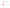 |
| [thermal-overload](resolved/thermal-overload.json) | Thermal overload relay, thermally operated release | symbol | unverified |  | 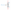 |
| [transformer](resolved/transformer.json) | Transformer with two windings, general symbol | symbol | unverified |  |  |
